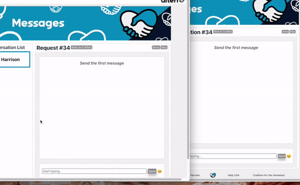

`Alteri` is a platform connecting users in need of basic necessities with donors in their area. Ultimately spreading compassion by helping the less fortunate.

Requires [Alteri front end](https://github.com/jeffreyc86/alteri-frontend) and [Alteri back end](https://github.com/jeffreyc86/alteri-backend).

## Live Link & Demo

Visit the [Live Link](https://alteri-client.netlify.app/) 

Watch the [Demo](https://www.loom.com/share/471914886e254936afc0976c14b0b3c2)

## Technologies Used

`Alteri` is built with a `React` front end, a `Ruby on Rails` & `PostgreSQL` back end, `Redux` for universal state management, and `ActionCable` to integrate WebSockets. All styling was done with custom CSS. The live link of `Alteri` is deployed on [Netlify](https://www.netlify.com/) with [Heroku](https://www.heroku.com/) for the back end.

## Features

The word ***alteri*** itself comes from the root of the word **altruism**, which was the basis for the app. Users are both able to create requests for basic necessity items and fulfill requests. Once a recipient is connected with a user, a live chat is set up to figure out the exchange logistics. Compassion included.

### Signing Up / Logging In

Users are able to sign up or login. There are validations to when creating an account. They may also register using their Google account. Once logged in, they're brought to their profile page where they'll see all their past requests and donoations.

### Creating Requests

When creating requests, users may select from a set list of items. The items are separated by category and users may filter items by name. Certain food and clothing items allow the user to specify a quantity and/or preference. All other items default to a quantity of one.

There is a limit of 10 items per request. Once exceeded, an alert appears. Users are also able to remove items from their request by clicking remove.

Once a request is complete, the user is brought back to their profile page where they'll see the newly created request with a pending status.

### Fulfilling Requests

Users are able to view all the current pending requests and filter them by distance to the user. If they have all the items requested, they may accept the request. Once accepted a chat will be assigned to the recipient and the donor.

Once a request is accepted, the status for the request will now show as accepted for both the recipient and donor.

Within the chat, they'll be able to see the items on the request, as well as a map showing the distance between the two users. The map uses GoogleMap's API and pinpoints both users' geolocations.

The recipient and donor are able to chat in real-time due to the WebSockets integration, as well as send emojis. 

Once the exchange has been made, either user can mark the request as fulfilled. Doing so will be reflected for both the recipient and donor. The status of the request on their profile page will be updated to fulfilled.

### Logging Out

When a user is complete with their session, they're able to log out. Once logged out, they're brought back to the home page.

### Accessibility

Alteri was created with all custom CSS and the use of media queries, making the app is mobile friendly. The sizing of all elements adjust depending on the window size.

## License

The [MIT](https://choosealicense.com/licenses/mit/) License

Copyright (C) 2021 - [Jeffrey Chiu](https://github.com/jeffreyc86) 